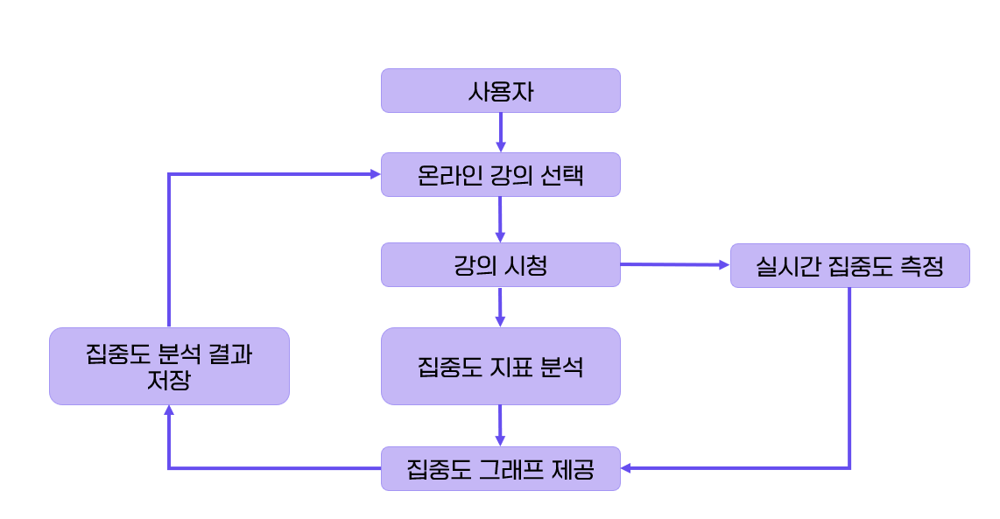
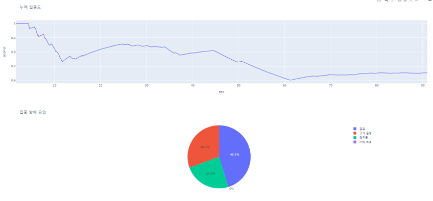

# SKKU 해커톤 
## 당신의 집중력을 끌어올려 드립니다 "Focus Maker"

온라인 학습자 집중도 지표 측정 및 자가 피드백 서비스
## 주관적인 집중도 지표
1. 집중
2. 핸드폰
3. 졸음
4. 얼굴 인식 X

## 서비스 구성도



## 프로토타입



## 결과 및 분석 제공

- 시간별 집중도 : 20프레임 전부터 현재까지 가중이동 평균으로 현재 집중도를 계산

- 누적 집중도 : 전체 프레임에서 집중한 프레임의 비율을 계산

- 집중 방해 요인 : 집중하지 않은 프레임의 요인을 분석

- 시간 분석 : 전체 시간의 해당 항목을 분석


## 사용방법

1. 얼굴 인식을 위한 얼굴 인식 가중치를 다운받는다. - [가중치 다운](https://drive.google.com/file/d/1m6eOs6lGYVKuJS9GWVuuTlbXb_X62Oee/view?usp=sharing)

2. ```pip install -r requirements.txt``` 패키지 설치

3. ```detect.py```를 통해 localhost 접속